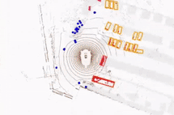
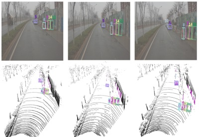

## News
- hello

## Publications

\* denotes equal contributions and † denotes the corresponding author.
 

  

    
  

  

     
      Separated RoadTopoFormer 
    
     
      Mingjie Lu*, <b>Yuanxian Huang*</b>, Ji Liu, Jinzhang Peng, Lu Tian, Ashish Sirasao
       
    
     
      Arxiv, 2023 
    
    
      [<a href="https://arxiv.org/abs/2307.01557">Paper</a>]
     
  

  <!-- 
 -->
    
  <!-- 
 -->
  

     
      MENet: Map-enhanced 3D object detection in bird’s-eye view for LiDAR point clouds 
    
     
      <b>Yuanxian Huang</b>, Jian Zhou&dagger;, Xicheng Li, Zhen Dong, Jinsheng Xiao, 
      Shurui Wang, Hongjuan Zhang
       
    
     
      JAG 2023 (IF:7.5) 
    
    
      [<a href="https://www.sciencedirect.com/science/article/pii/S1569843223001590">Paper</a>]
      [<a href="https://github.com/WHU-USI3DV/MENet">Code</a>]
     
  

  

    
  

  

     
      HDM-RRT: A Fast HD-Map-Guided Motion Planning Algorithm for Autonomous Driving in the Campus Environment 
    
     
      Xiaomin Guo, Yongxing Cao, Jian Zhou, <b>Yuanxian Huang</b>, Bijun Li&dagger;
       
    
     
      Remote Sensing, 2023 (IF:5.0) 
    
    
      [<a href="https://www.mdpi.com/2072-4292/15/2/487">Paper</a>]
     
  

  

    
  

  

     
      Lane Information Extraction for High Definition Maps Using Crowdsourced Data 
    
     
      Jian Zhou, Yuan Guo, Yaoan Bian, <b>Yuanxian Huang</b>, Bijun Li
       
    
     
      IEEE Transactions on Intelligent Transportation Systems, 2022 (IF:8.5) 
    
    
      [<a href="https://ieeexplore.ieee.org/document/9956852">Paper</a>]
     
  

  

    
  

  

     
      Cooperative Motion Planning with 3D Spatio-temporal Map for Connected and Automated Vehicles in Intersection 
    
     
      Yongxing Cao, Bijun Li, Hongjuan Zhang&dagger;, Duanfeng Chu, <b>Yuanxian Huang</b>, Xiaomin Guo
       
    
     
      CVCI, 2022 
    
    
      [<a href="https://ieeexplore.ieee.org/document/9965066">Paper</a>]
     
  

  

    
  

  

     
      Roll-Sensitive Online Camera Orientation Determination On The Structured Road 
    
     
      <b>Yuanxian Huang</b>, Jian Zhou&dagger;, Bijun Li, Jinsheng Xiao, Yongxing Cao
       
    
     
      ISPRS Congress, 2022 
    
    
      [<a href="https://isprs-archives.copernicus.org/articles/XLIII-B2-2022/687/2022/">Paper</a>]
     
  

  

    
  

  

     
      Camera-LiDAR Fusion for Object Detection, Tracking and Prediction 
    
     
      <b>Yuanxian Huang</b>, Bijun Li, Qi Huang, Jian Zhou&dagger;, Lanlan Wang, Jialin Zhu
       
    
     
      Geomatics and Information Science of Wuhan University, 2022 
    
    
      [<a href="http://ch.whu.edu.cn/cn/article/doi/10.13203/j.whugis20210614">Paper</a>]
     
  

