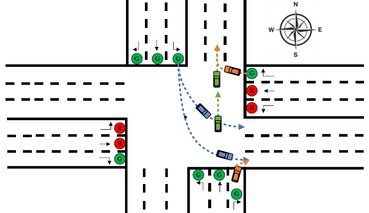

I'm a M.S. stundent of [LIESMARS](http://www.lmars.whu.edu.cn/en/), [Wuhan University](https://en.whu.edu.cn/), supervised by Prof. Bijun Li and Jian Zhou. Previously, I received my B.Eng. from [SGG](http://main.sgg.whu.edu.cn/) of Wuhan University. My interest mainly focus on autonomous driving perception system, including 2D/3D object detection, BEV segmantic segmentation, online HD map construction, topology reasoning, occupancy network and so on. 

## Publications

\* denotes equal contributions and † denotes the corresponding author.
 

### Separated RoadTopoFormer

  
    Mingjie Lu*, <b>Yuanxian Huang*</b>, Ji Liu, Jinzhang Peng, Lu Tian, Ashish Sirasao 
    Arxiv, 2023 
    <a href="https://arxiv.org/abs/2307.01557">[paper]</a> 
  

### MENet: Map-enhanced 3D object detection in bird’s-eye view for LiDAR point clouds

  
    <b>Yuanxian Huang</b>, Jian Zhou&dagger;, Xicheng Li, Zhen Dong, Jinsheng Xiao, Shurui Wang, Hongjuan Zhang 
    JAG 2023 (IF:7.5) 
    <a href="https://www.sciencedirect.com/science/article/pii/S1569843223001590">[Paper]</a><a href="https://github.com/WHU-USI3DV/MENet">[Code]</a> 
  

### HDM-RRT: A Fast HD-Map-Guided Motion Planning Algorithm for Autonomous Driving in the Campus Environment

  
    Xiaomin Guo, Yongxing Cao, Jian Zhou, <b>Yuanxian Huang</b>, Bijun Li&dagger; 
    Remote Sensing, 2023 (IF:5.0) 
    <a href="https://www.mdpi.com/2072-4292/15/2/487">[Paper]</a> 
  

### Lane Information Extraction for High Definition Maps Using Crowdsourced Data

  
    Jian Zhou, Yuan Guo, Yaoan Bian, <b>Yuanxian Huang</b>, Bijun Li 
    IEEE Transactions on Intelligent Transportation Systems, 2022 (IF:8.5) 
    <a href="https://ieeexplore.ieee.org/document/9956852">[Paper]</a> 
  

### Cooperative Motion Planning with 3D Spatio-temporal Map for Connected and Automated Vehicles in Intersection

  
    Yongxing Cao, Bijun Li, Hongjuan Zhang&dagger;, Duanfeng Chu, <b>Yuanxian Huang</b>, Xiaomin Guo 
    CVCI, 2022 
    <a href="https://ieeexplore.ieee.org/document/9965066">[Paper]</a> 
  

### Roll-Sensitive Online Camera Orientation Determination On The Structured Road

  
    <b>Yuanxian Huang</b>, Jian Zhou&dagger;, Bijun Li, Jinsheng Xiao, Yongxing Cao 
    ISPRS Congress, 2022 
    <a href="https://isprs-archives.copernicus.org/articles/XLIII-B2-2022/687/2022/">[Paper]</a> 
  

### Camera-LiDAR Fusion for Object Detection, Tracking and Prediction

  
    <b>Yuanxian Huang</b>, Bijun Li, Qi Huang, Jian Zhou&dagger;, Lanlan Wang, Jialin Zhu 
    Geomatics and Information Science of Wuhan University, 2022 
    <a href="http://ch.whu.edu.cn/cn/article/doi/10.13203/j.whugis20210614">[Paper]</a> 
  

## Education

### Wuhan University (WHU)

  
    September 2021 - Present 
    Major: M.S. in Photogrammetry and Remote Sensing 
    Hornor: National Scholarship 2023 
  

### Wuhan University (WHU)

  
    September 2017 - July 2021 
    Major: B.E. in Surveying and Mapping Engineering 
    Hornor: National Scholarship 2023 
  

## Experience

### AMD

  
    March 2023 - October 2023 
    Position: Co-op/Intern, Algorithm R&D in AIG-AIE 
    Focus: Road Topology Reasoning, Model Pruning, Occupancy Network 
  

### ArchDrive

  
    March 2021 - June 2021 
    Position: Intern, Perception Algorithm 
    Focus: Lane Detection, Lane Keeping 
  

